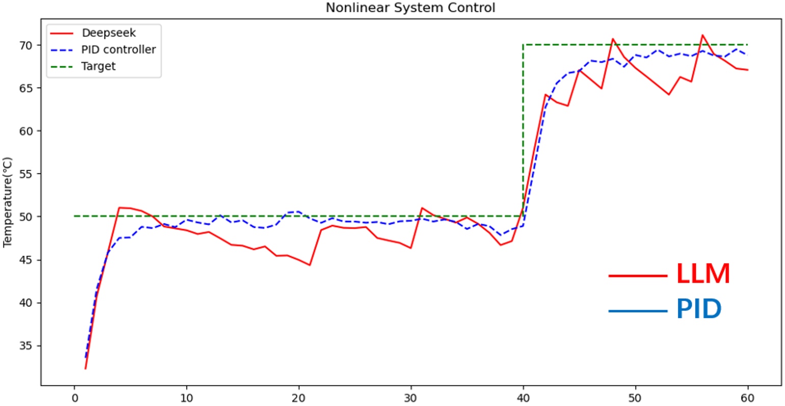

# LLM_controller_agent
Closed-loop Control Testing with LLM-Generated Outputs: Featuring Simulation & Real-time Industrial Data Interaction. 
   <!-- 这是空行间隔 -->

# LLM_control_framework

  

  *Figure1: Framework*

   <!-- 这是空行间隔 -->

# Simulation Result

  

  *Figure2: Simulation result*

   <!-- 这是空行间隔 -->

# Real-time industrial data result
   <!-- 这是空行间隔 -->

  

  *Figure3: Kp_result*

   <!-- 这是空行间隔 -->

  
  
  *Figure4: Ki_result*

   <!-- 这是空行间隔 -->

  
  
  *Figure5: Kd_result*

# Advanced research
Fine-tuned LLM / LLM local deployment / LLM control interacts with data-twin simulator.

   <!-- 这是空行间隔 -->
